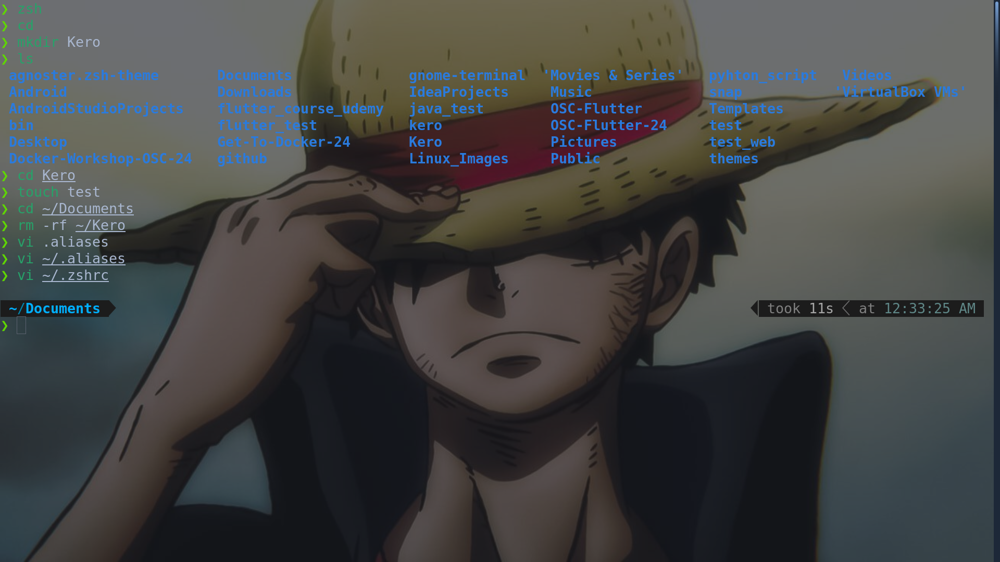
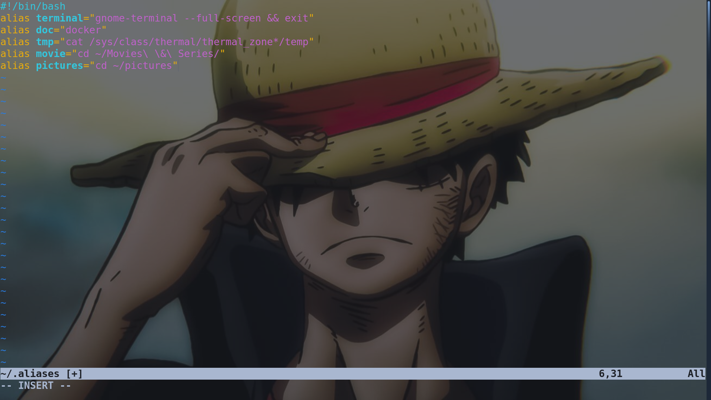
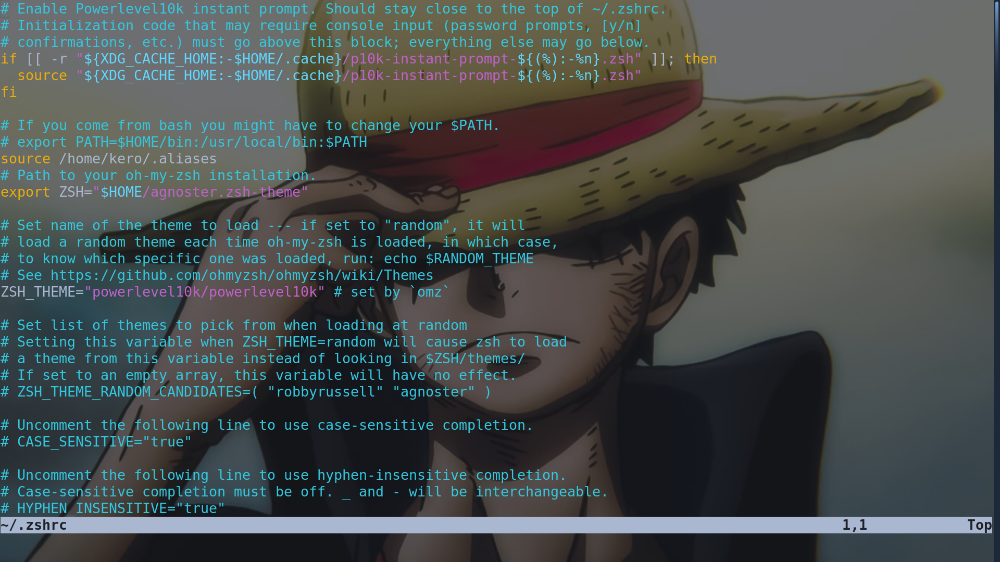
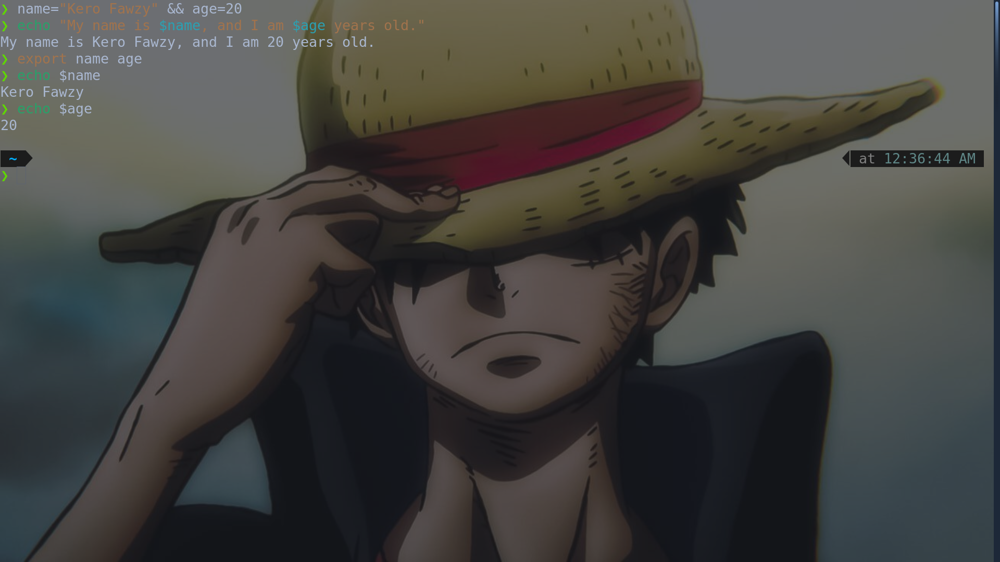
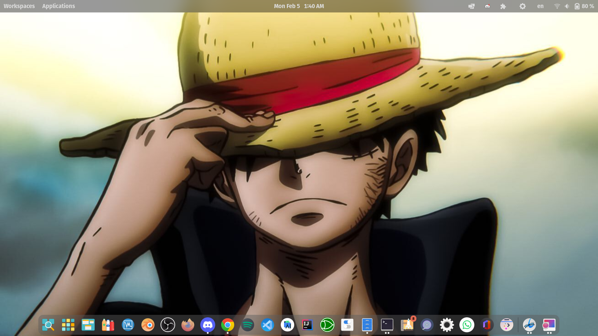

# theme customize

I used Bluesky theme, oh my zsh, Blur my shell, Fluent Dark Cursors, and Infinity Dark Icons

# Steps 1-5

I captured all commands I used with one Screenshot

# Aliases

# .zshrc

Full Content of file: [zshrc](./zshrc)

# Step 6
<h3>Shell Variables: only visiable and accessed in Shell Seassion</h3>
<h3>Environment Variables: Like Global variables</h3>
# Step 7-8

I captured all commands I used with one Screenshot

# Desktop Environment
I used GNOME because I feeled like it is easier to reach the look what I want with it but I forgot that GNOME is a VRAM killer :(

Now, I am still using gnome but I installed KDE recently because I found that I can reach the same look with it and for me KDE so powerfull than GNOME, so I am planning to switch KDE in the future.

And Here's The Current Look of My Desktop

